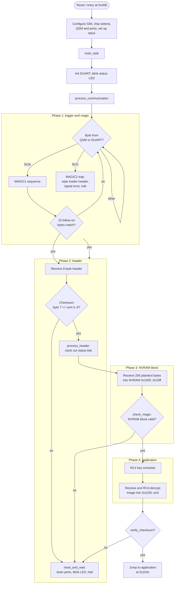

# MC68331 Loader

A bare-metal serial bootloader for MC68331 (CPU32) database hardware.
It receives an application image over a serial link (either the
on-chip QSM/SCI port or an external DUART), decrypts it, writes it into NVRAM,
verifies it and jumps to it.

The image expects to live at `0x400` in memory and to be entered at `0x408`.
The first eight bytes at `0x400` are a fixed signature (`7C "load" FD C4 55`),
they mark a valid loader and can be wiped by the loader itself
as an anti-tamper measure.

## Memory map

| Address          | Purpose                                                |
|------------------|--------------------------------------------------------|
| `0x400`          | Loader image base; signature at `0x400`, entry `0x408` |
| `0x1000`–`0x10ff`| NVRAM control block (received as plaintext)            |
| `0x1004`         | Application end address                                |
| `0x100c`         | Header magic                                           |
| `0x104c`         | Application entry point                                |
| `0x1100`         | Application image (decrypted in place)                 |

## Building

```sh
docker run -v .:/opt/m68k_bare_metal/src/ ghcr.io/stoneddiscord/m68k_bare_metal:master make rom
```

Or directly with an `m68k-eabi-elf` toolchain:

```sh
make rom        # produces loader.rom (raw binary)
make srec       # produces loader.srec
make dumps      # disassembly of the linked loader
```

## Hardware setup

On reset, `main()` programs the SIM (clock, watchdog, chip selects), the QSM
serial controller and the parallel/timer ports, sizes the stack from the top of
RAM, then transfers control to `main_task()`.

## Boot flow



## Protocol summary

1. **Trigger** — the loader polls both serial ports for a trigger byte. `0x1b`
   begins the normal `MAGIC1` handshake; `0x7c` begins `MAGIC2`, which is a trap
   that wipes the loader signature and halts (it can never complete).
2. **Magic** — 15 follow-on bytes are checked against the expected sequence
   (each expected byte is the table entry `+ 1`).
3. **Header** — an 8-byte header is received; byte 7 must equal the sum of bytes
   0–6. A non-zero header triggers `process_header`, which clocks status bits out
   on a control port.
4. **NVRAM block** — 256 plaintext bytes are received into the NVRAM control
   block at `0x1000` and validated by `check_magic` (complement pairs, bounds and
   header magic).
5. **Application** — the RC4 key schedule is initialised, then the image is
   received and decrypted byte-by-byte into RAM starting at `0x1100`, up to the
   end address stored at `0x1004`.
6. **Verify and run** — `verify_checksum` re-checks the loaded image; on success
   the loader jumps to the application entry point at `0x104c`, otherwise it
   blinks an error pattern and halts.
